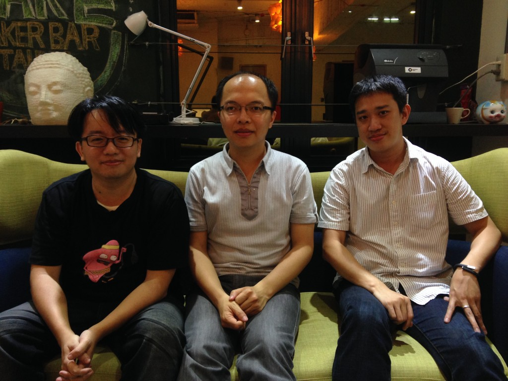
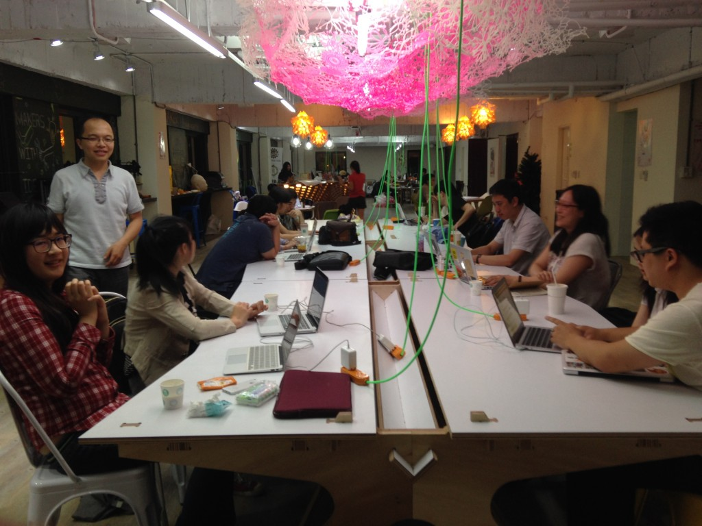
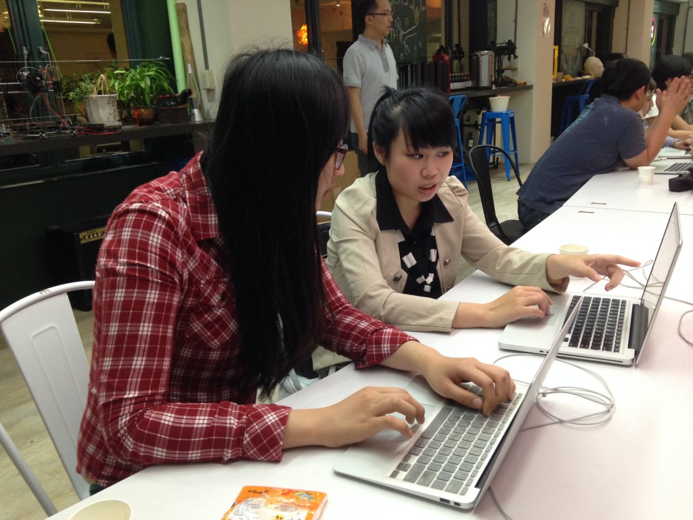

# 導入社會企業思維，「五倍紅寶石」要永續經營 Ruby 開發者社群

2014 年 06 月 04 日

來源：https://panx.asia/archives/15525

一個良好的生態系往往都是由社群所組成，供給的社群、需求的社群，環環相扣，才能產生更大的效應，建立正向回饋的發展循環。這樣的形態，在開發圈也是一樣的，台灣有許多開發者社團，其中，在去年引進了「女生也可以寫程式：Rails Girls」的 Ruby 開發者社群，可說是近來程式界最吸睛，他們正努力的想要建立 Ruby 的生態圈，PanX 有幸在他們的固定活動「Let’s Try Rails Tuesday」中採訪到了 2013 年 Ruby Conf、Rails Girls 的召集人，以及「五倍紅寶石」的創辦人鄧慕凡、高見龍，透過他們的角度，了解現在台灣的 Ruby 發展。

## 台灣的 Ruby on Rails 開發者社群，現在有哪些社群活動呢？

鄧：目前有從去年九月開始已經舉辦三次的 Rails Girls、每週二不定期舉辦的 Ruby Tuesday 以及大型年會 Ruby Conf。其中比較特別的就是 Rails Girls，我們只是把 Rails Girls 從國外引進，當初引進的目的也很單純，只是想要改變這個圈子的性別平衡，目前累積約 150 名學員。

高：許多人都以為 Rails Girls 像補習班一樣，但我們考慮講座學習效果不是很好，所以 Rails Girls 是採取一天半內，以一個教練對一到兩個學員，完全免費的小班教學，而且學員全部都女性；第一次剛開就有 300 多人報名 20 人的活動，這樣的結果完全出乎我們的意料，因此第二次就擴大辦理，錄取到 75 人。後續因為詢問度太高，所以就連續舉辦了（今年三月），其實大家都玩得很開心。

鄧：75 人已經是我們的上限了，實際上這個社群也沒有這麼多教練可以支援，教練不是單純只需要技術，同時也要有耐心、有辦法教導別人才行。但「新手是最好的教練」，有些學員因為有過過去的經歷，所以多來幾次之後就會變成教練，只是目前這個能量還需要慢慢累積。

高：第二次 Rails Girls 後，就有很多學員在問，我該怎麼繼續進修？於是我們就開辦了 Let’s Try Rails Tuesday（學員限女性，目前已經舉辦 21 次），但是這個活動就必須要讓學員負擔部分場地費用，每個人酌收 200 元場地費（編按：感謝 Maker Bar 以人頭計費的方式）。但是教練也是自費來，他們出錢又出力，實在很感激。

高：另外為了要兼顧到我們這種阿宅（編按：XD），因此在今年會開辦 Taipei.rb ，這個聚會就不限制性別的，只是新的聚會要有人、活動去推，三、四月份我們人力、時間有限，所以延宕至今，未來我們希望能把這些 Ruby 社群都放在一個場地，做分區，讓不同區域、主題的與會者可以自行走動交流，有點像 Ruby co-working space。但是場地就比較不好找。

高：第一個還是得面對教材極少中文化的問題，即使網路上風聲、報導很多，但還是得面對英文教材，所以往往 Ruby 被迫成為外語能力極好的一群……，我第一次參加聚會的時候，還在想「莫非這邊的人不是留美就是 ABC？」。

鄧：人數不夠所以才需要推廣，而我覺得人數不夠是因為「觀念」的不同，企業會覺得這個技術太新，沒有試過，也不能確定成效，寧願花比較少錢去找便宜的人，工程師沒有學過、市場上也比較少相應的職缺，需求消失了，自然沒有供給，因此就進入了一個惡性循環。

自稱阿宅的三位召集人，左起高見龍、鄧慕凡、蘇泰安

## 有考慮過把這股程式力量導入商業模式，或是從事某種固定的目標，進而擴大社群的基數嗎？

高：目前 Ruby 的活動長期依靠贊助以及社群的能量，但這並不是一個很長遠的做法，因此我們成立了一個商業性公司「五倍紅寶石」（Ruby ，紅寶石之意），目的是希望能對企業做教育訓練，透過這樣的做法把 Ruby 導入企業。這其實是很冒險的，因為我們並不希望讓大家覺得我們在消費社群，或是誤解我們有圖利自己的行為。

但也不可諱言，我們人手不足，我們只有四個人，就只好去找業界的教練，但是這件事情會與社群獨立，我們以鐘點費聘請講師，目前也已經募集了十來位。之後會開始第一波課程。

## 「五倍紅寶石」的成立動機是？

高：其實去年有個起源，當時是我想要找員工，但台灣野生的 Ruby 開發者不是去大公司年薪百萬，就是去創業了，所以後來我就希望能找初學者、或是有興趣的人來作為學徒，從頭開始培養，沒想到只要 3 個人卻有 70 幾人報名，雖然挑人挑的很辛苦，但這件事情也讓我們開始思考：如果大家都對 Ruby 有興趣，那就一起教他們吧！於是就在輔大弄了一個為期五周（週末）的工作坊，沒想到報到率很高，學員也很踴躍，進而促成了 Rails Girls 以及後續這些想法。

鄧：我們在經營的社群過程中，看到了這個市場供不應求，國外 Ruby 的盛行程度遠遠不是台灣可以比擬的，因此許多外商都願意以百萬年薪聘請資深工程師（Ruby 只要 2 年就算是資深了，只要不要太偷懶，持續有在做一點東西）。但事實就是台灣並沒有足夠多的人才。雖然網路上風聲很多，但是真的有在用的就那些。

高：五倍紅寶石就是希望能主動打開這個市場的缺口，假設老闆需要大家換系統，但又不想要找新人，這時我們就可以幫忙教學。但是目前我們也不確定會不會獲利，如果會獲利的話，我們就會再把這些利潤，投入 Ruby 相關活動的支出，畢竟取之於社群，用之於社群。但我們還是很小心，怕會落人口實。

鄧：我們會做這樣的事情也是借鏡 Ruby 之父松本行弘，他想要推動日本 Ruby 的產業鏈，因此透過政府來推動成立 Ruby 協會，並且鼓吹政府案子交給 Ruby 開發者，這樣就把產業做了起來，所以第一步就是教育與導入。

收人頭的 Maker Bar，佛心來著（就是打廣告XD）。

## 那麼，整個團隊今年有什麼期許呢？

高：希望 Rails Girls 能繼續辦下去……（編按：女生在工程界是稀缺資源啊！XDDDDD）因為其他成員的是阿宅，隨便一點其實還好，但是 Rails Girls 希望能夠讓女生可以有自在的感覺，為了打造這個環境，我們挑學員、挑場地、挑教練，就是希望能做到自在的程式普及，真正目標還是希望讓這個圈圈變大，試著從這個社群的圈圈出發，進而推廣 Ruby！

「我們追求的是生態系的永續經營」，幾位創辦人異口同聲地說，五倍紅寶石希望透過推廣教育來擴大Ruby在台灣的需求、供給面，如果能從中獲取利潤，再投入社群來舉辦更多的活動；在採訪的過程中，可以看出經過多次活動的焠鍊、不斷與市場溝通後，五倍紅寶石已經有一個非常明確並可行的商業模式與目標，或許未來可以考慮將國外資源更大量直接的引入，透過轉介國外公司的職缺，來擴大這個產業的需求，畢竟要改善一個僵固的生態系並不容易，而當體制內的方式行不通的時候，就大膽尋求體制外的方式吧。

Rails Girls 回娘家，指導後進。

其實縱觀網創、新創團隊，我身為一個最接近 coder 的角色，發現「軟體正在吞噬世界」的趨勢不僅沒有衰退，還加速向前，但是新世代來了，我們的教育、體制、法規都顯然還沒有跟上，還記得新加坡要將 Coding 放進國小課綱嗎？

在這樣又著急又看不到方向的狀況之下，能看到像 Ruby 這樣的民間團體自發性的推廣技術，實在很讓人開心，你也是一個想學 Coding 卻不知從何入手的人嗎？那麼他們的[課程](https://5xruby.tw/talks)應該很對你的胃了。
