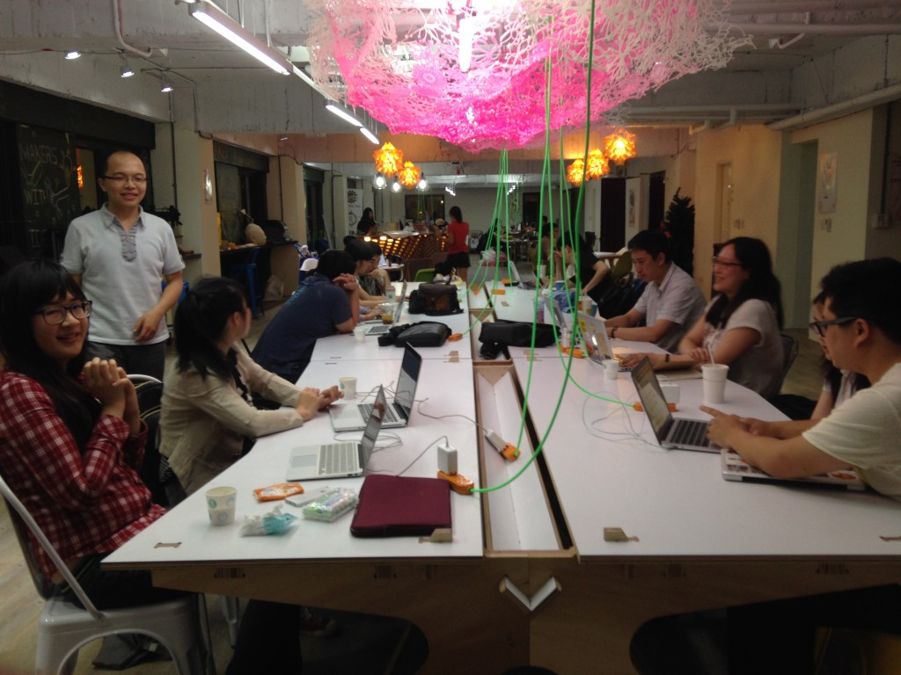

# Ruby 語言推廣公司「五倍紅寶石」推企業代訓，因為傳統獵才行不通

2016 年 05 月 20 日

來源：https://panx.asia/archives/48782

## 求才 v.s. 求職 v.s. 社群

上個月，致力在臺灣推廣程式語言 Ruby 的[五倍紅寶石公司](https://5xruby.tw)推出一套「企業代訓計畫」：

1. 企業提出訓練需求（人數、期望能力、薪資）。
2. 尋找合適人選：由企業先行面試可能人選，或由五倍紅寶石協尋合適人選，並與企業進行第一次面談。
3. 三方（企業、受訓學員以及五倍紅寶石）簽定合作合約，由五倍紅寶石進行密集訓練。
4. 訓練期滿，學員回至企業上班。

五倍紅寶石的共同創辦人高見龍說，這個計畫起因於他們實在太常接到幫忙推薦 Ruby 或 Ruby on Rails（Ruby 的 Web 開發框架）人才的請求。「和其他類似的語言例如 PHP 相比，Ruby 的普及率低、拿來工作的人數相對較少，但它的需求 ─ 尤其是在新創領域 ─ 其實不小。Ruby / Rails 人才難尋找，我們常遇到客戶來求救，問能不能幫忙收尾，當然更不用提若想進一步延伸開發、以及後續維護該怎麼辦，企業需要的是有能力、長期且固定的開發者。」

「反過來，如果我們幫企業訓練信任的人，應該可以更直接地解決問題。」共同創辦人趙子皓說，每家來徵才的企業都有自己的文化，就企業而言，由他們來面試，找到認為適合自家的人，或直接送來合作很久的夥伴、親友；對員工來說，能保證在受訓後直接有工作。這也能讓 Ruby 圈的人越來越多，對求才、求職與五倍紅寶石三方都是好事。

## Ruby 技術藏在腦袋裡，只有「鑑定商」知道行不行

在此之前，五倍紅寶石主要有兩個業務：教育訓練（一般課程或企業內訓），以及客戶委託專案（多為香港、新加坡、日本等國外客戶）。這次代訓計畫，等於整合了企業內訓和以前常受託協助的人才媒合。

費用方面，五倍紅寶石認為培訓人才本來就是企業的責任之一，所以將向企業收取該受訓者 15 ~ 20% 之年薪作為訓練費用，而對受訓者則僅收半個月的月薪，把以前工程師自己去外面上課的學費轉嫁到企業身上，以這種比較健康的模式讓企業真正找到人才。

Ruby 與相同等級的語言相比，普及率較低、拿來工作的人較少（Photo via MATSUOKA Kohei@flickr, CC License）

「形式上有點像獵人頭公司，但他們收 15~20% 年薪的服務費並不會幫你訓練，風險其實頗高。首先他們不知道去哪找人、第二是找到了人卻不一定有能力鑑定是否符合企業需求。傳產或管理職可能可以藉由面試了解，但 Ruby 的技術藏在腦袋裡，獵人頭公司沒有這個鑑定能力，不會問太多技術問題。」而五倍紅寶石本身就是第一線開發者，就好像「紅寶石鑑定商」（這也是高見龍在名片上的職稱），他們可以透過簡單的面試或社群朋友的風評，知道這個人行不行。

「不過說實在的，我們也不相信程式語言有『速成』這件事，五倍紅寶石自家開設的 36 小時 Rails 課程可以教你基礎與架構，剩下的還是要不斷練習、摸索，因此會在訓練中讓大家製作一些簡單的實用系統。」他並表示代訓計畫規劃為上班日的 10:30 ~ 18:30，每週 3 天以上，受訓者會一天 6 小時處於這個情境，希望透過這樣的密集訓練，更快養成學員們可以實作的即戰力。

高見龍也坦言，臺灣的中小企業對員工培訓不算太重視。「企業期望員工來上班就有即戰力，也不一定會撥預算讓自家工程師去參加其它的進修課程，都不是公司設計好的培訓計畫。」

> 常言道「十年磨一劍」，但企業無法等你十年，我們能做的是盡可能在兩三個月內讓受訓學員實際接觸真正案例，從中吸取經驗值，快速成長到可以工作的即戰力。

「Rails 是一個框架，開發網站就像在組合樂高積木，的時候有說明書參考，但如果抽掉這個你能不能靠自己的力量做出來？我們培養的是這樣創造能力。另外，若想快速成長，最好的方式還是直接丟進實際的專案中，累積實作解任務經驗。」

這也算是他們一路以來的作法，包含之前主推女生寫 Ruby 的「[Rails Girls](http://railsgirls.tw/)」活動，不難看見五倍紅寶石強調實戰與交流傳承的精神。

參與過 Rails Girls 活動的前艾思網絡 Rails 工程師 Annie 就說，和五倍紅寶石一起學習的經歷讓自己在往後公司開發專案時能更快進入狀況，節省不少自我摸索的時間。她還曾以 Rails Girl 的身分拿到獎助金，前往日本參加亞洲最大的 Ruby 年度聚會 [RubyKaigi](http://rubykaigi.org/)，「我還在活動中遇到 Ruby 之父松本行弘，原本很緊張，但他竟然和我們聊起他的小孩不喜歡寫程式，非常親切。」另外她也從這裡的人脈網絡中獲益良多，除了實務技巧，還能和業界專家們交流專案問題，甚至團隊協作。

推動女生寫程式的 Rails Girls 也曾舉辦「回娘家」活動，以前輩帶後進的方式交流

## 第三年了，還是要做社群

他們說，「社群參與」可以有很多種角色身分，包含一般與會者、講者、活動主辦單位等，五倍紅寶石就曾以贊助方式協助 PHPConf、學生自辦的計算機年會 SITCON（高見龍笑道：我們也待過沒錢那個階段），也會視狀況支援其他活動人力或技術。

自己策劃的 Ruby 推廣活動也各式各樣。不僅邀請國內外高手、Ruby 之父以論壇進行的大型年會 [RubyConf Taiwan](https://rubyconf.tw)，同時也每一至兩個月辦一次活動（Taipei.rb），邀請各界 Ruby 使用者們分享工作狀況，建立社群定期的交流管道；另外也打算延續之前的 Rails Girls 活動。

五倍紅寶石也會無償提供活動空間，希望各類型社群活動都能蓬勃發展（照片取自五倍紅寶石）

五倍紅寶石以「社群」起家，幾年下來也看見 Ruby 社群裡的變化。「雖然 Ruby / Rails 的使用者增加、社群變大了，但以前那種同樂會的感覺似乎越來越薄弱，現在大家比較會考慮活動中聽到的東西能不能帶回工作上使用，參與人數沒變少，拿來當興趣的比例倒是降低了。」

「有些人會認為參與社群活動等於上課、聽講就是要學習，但事實上我們期望的社群活動並沒有要教大家寫語法，而是分享一些實際解決問題的經驗。」共同創辦人鄧慕凡說，能將寫程式這件事看成「不只是工作」的人很少。

> 「很簡單，你下班還會不會想去碰？其實不容易做到，但很厲害的人通常是這樣。」

