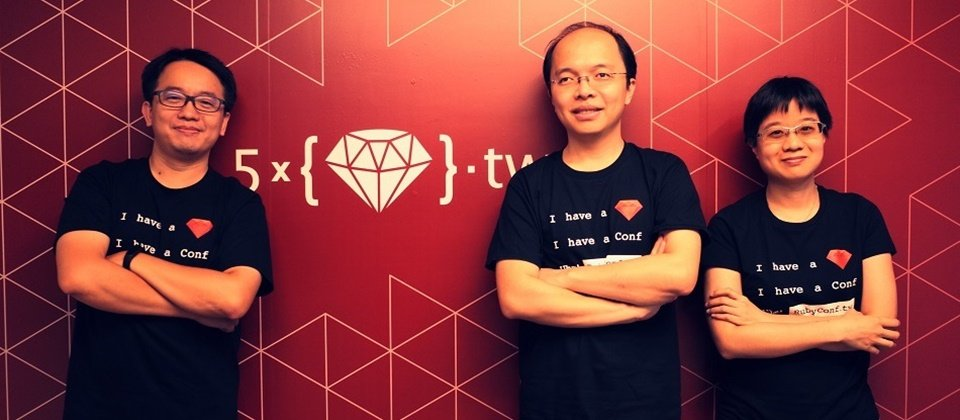
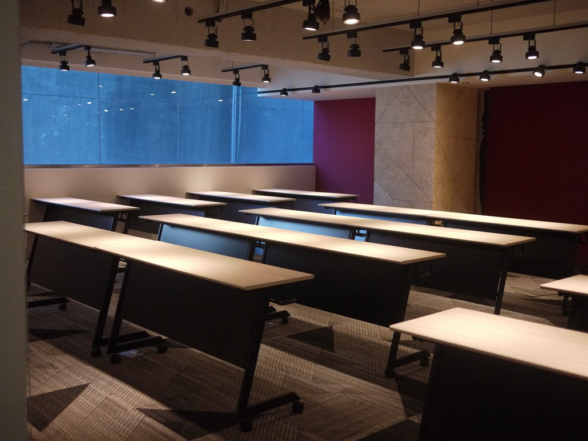
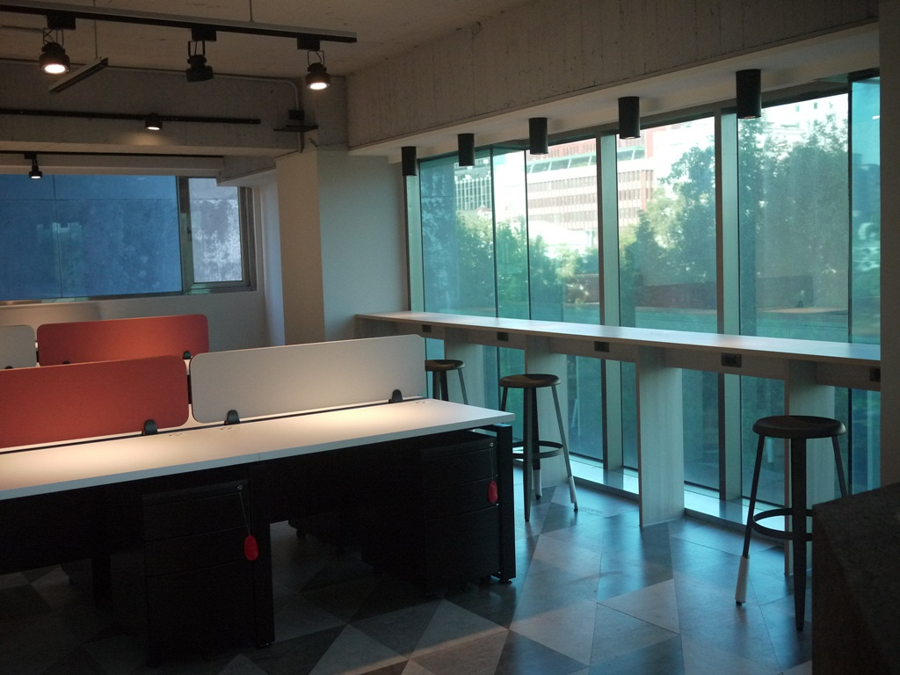
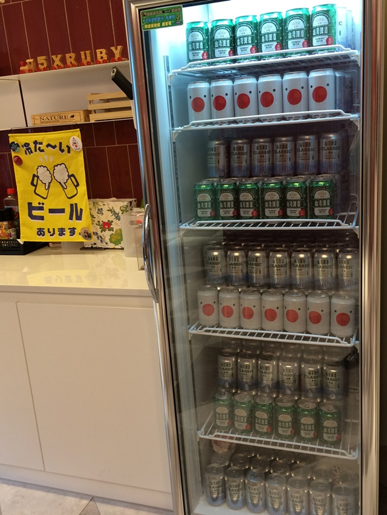

# 臺灣RoR團隊揚名國際，新加坡電商新創買下五倍紅寶石搶人才

五倍紅寶石創辦人高見龍透露：Shopmatic曾來臺看到我們舉辦RoR社群活動的盛況，更讓他們決定買下五倍紅寶石，因為這也是他們未來尋找更多RoR人才的基礎，所以，非常支持我們繼續投入社群。

2016 年 12 月 15 日

來源：http://www.ithome.com.tw/news/110345

新加坡電商新創Shopmatic今天宣布併購臺灣RoR開發團隊五倍紅寶石（5xRuby）。1年半前，五倍紅寶石因承包開發Shopmatic網站而認識，雙方合作非常愉快，當時Shopmatic高層就曾表達投資之意。直到1年前，Shopmatic希望擁有一個專屬的RoR開發團隊，來提供穩定的開發能量，因而和五倍紅寶石開始洽談併購事宜，最近才定案。五倍紅寶石創辦人高見龍表示：「五倍紅寶石未來將成為Shopmatic在臺的子公司，而不會搬到新加坡，現有服務和承包專案都會持續，不會有太大異動。」不過，高見龍囿於合約，沒有透露併購金額。

新加坡電商新創Shopmatic是3位前PayPal亞太區主管聯手創立的跨國電商SaaS平臺(EC as a Service），主要鎖定中小企業主，協助賣家或企業主快速利用套件和樣版，來設計出自己的網路商店，還可協助整合多種支付通路，提供銷售和庫存分析機制，Shopmatic也和物流服務結盟，可整合到賣家線上商店中。Shopmatic可說是一個提供全套電商平臺服務的新創公司。Shopmatic從2014年底創立至今，已快速拓展到3個國家提供EC平臺服務，包括新加坡、印度和香港，目前約有1萬家商店使用Shopmatic平臺設計網路商店。

而Shopmatic看上的五倍紅寶石，是由一群臺灣RoR社群愛好者同樣在2014年創立的公司，三位創辦人高見龍、鄧慕凡、趙子皓都是Ruby社群活躍成員，經常投入臺灣RoR社群活動和推廣訓練，後來更決定以RoR教育訓練服務來創業。被併購之後，「五倍紅寶石仍會繼續在臺大力參與RoR社群活動。」高見龍強調：「Shopmatic曾來臺看到我們舉辦RoR社群活動的盛況，更讓他們決定買下五倍紅寶石，因為這也是他們未來尋找更多RoR人才的基礎，所以，非常支持。」

一個月前，五倍紅寶石才剛進駐新辦公室，目前團隊約20人，其中將近一半10人負責開發Shopmatic網站平臺，另有承接不少日本等海外的RoR開發專案。

五倍紅寶石新辦公室更像是教育訓練空間，平時不少社群活動都在此舉辦

冰箱啤酒這麼多，叫RoR開發人員要怎麼寫程式啊

