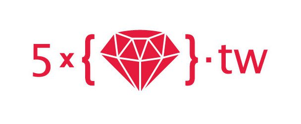

# 新加坡電商 Shopmatic 買下台灣 RoR 團隊五倍紅寶石！

2016 年 12 月 16 日

來源：https://www.inside.com.tw/2016/12/16/shopmatic-has-acquired-5xruby

新加坡電商公司 Shopmatic 昨天宣布收購台灣的 RoR 開發團隊五倍紅寶石。

Shopmatic 執行長 Anurag Avula 向 Tech in Asia 透露 ，這筆交易同時包括現金和股票，但他並未透露，實際的交易金額。

五倍紅寶石成立於 2014 年，由一群熱愛 Ruby 程式語言的工程師組成，主要提供諮詢、培訓和開發的服務。

Shopmatic 則主要針對中小企業提供電商服務，幫助他們在線上開店，把商品上架在像是 eBay、Amazon、Flipkart 和 Lazada 等平台上，並且提供他們工具，幫助其進行分析、庫存和物流的管理。

這家公司由 PayPal 前員工 Anurag Avula、Yen Lim 和 Kris Chen 創立，其成立宗旨主要是為了解決中小企業從事電商所遇到的困境和挫折。目前，他們主要的客戶多在印度。

此次收購，將有效提升 Shopmatic 的技術能力，並提供他們穩定的開發能量。儘管未來五倍紅寶石將成為 Shopmatic 在台的子公司，但不會搬到新加坡，而現有的服務和承包專案都會持續，不會有太大異動。
