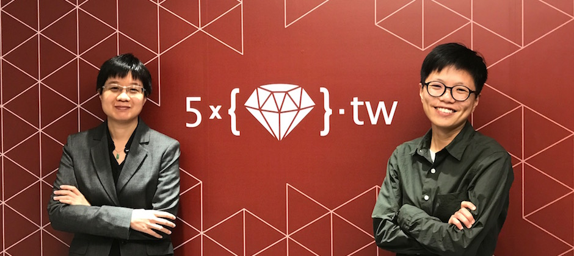
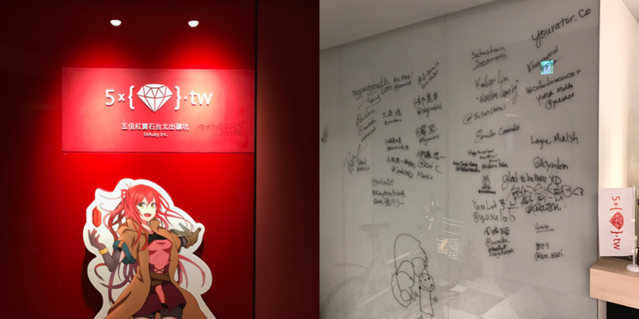
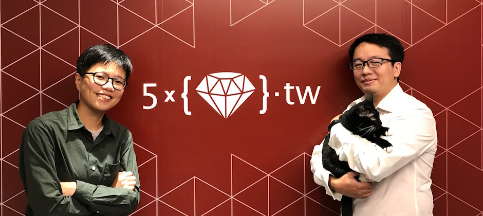
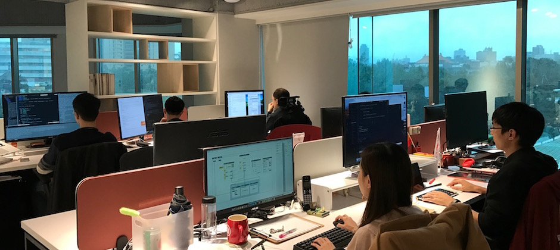
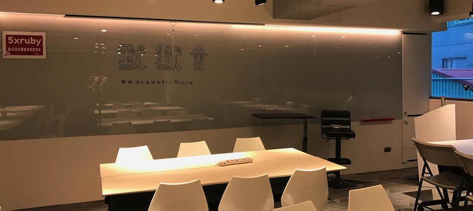

# 從社群出發！知名軟體開發公司「五倍紅寶石」裡閃閃發亮的女性工程師

2016 年 12 月 15 日

來源：https://www.yourator.co/articles/48

撰文者：王皓旻

上圖：本次的受訪者——五倍紅寶石共同創辦人趙子皓（左）、五倍紅寶石iOS工程師陳曉菁（右）

程式學習的風潮捲席全球！許多 Yourator 的求職者在跨入新創領域後，都會慢慢產生學習程式的想法。但由於對學習資源跟技術社群的認識不深，往往難以跨出第一步。本次 Yourator 職涯專訪，訪問了兩位在程式設計社群相當活躍的女性，希望讓各位讀者知道：學會擁抱社群，程式學習一點都不可怕！

「我們是間 Ruby 技術顧問公司，終極願景當然是希望未來台灣、甚至國際上，只要想到 Ruby 這個程式語言就會想到我們五倍紅寶石。就像講到Java大家就會想到Oracle(甲骨文) 這間公司一樣。」五倍紅寶石共同創辦人趙子皓笑著說。

剛獲得來自新加坡的新創電商集團 Shopmatic 的策略性投資（[相關報導](2016-12-15-5xruby-acquisition.md)），五倍紅寶石這家從「社群」出發的 Ruby 技術顧問公司，透過積極經營 RubyConf、Rails Girls、Taipei.rb 等 Ruby 技術社群，並提供深入淺出的 Ruby on Rails 課程（註：Ruby on Rails 是一個使用 Ruby的網站開發框架 ），短短兩年多的時間裡便在軟體業、新創圈闖出名聲。

圖一（左）：五倍紅寶石辦公室入口。圖二（右）：積極經營社群的五倍紅寶石，辦公室牆上留下了許多社群好朋友到此一遊的簽名。

身為五倍紅寶石 co-founder 的皓姐（趙子皓），從 WWW (World-Wide-Web) 的萌芽期，就在練習寫網頁前端，在過去任職的公司的跨部門合作過程中，認識到寫 code 的樂趣，於是開始在程式開發領域耕耘。

提到成為五倍紅寶石 co-founder 的機緣，皓姐說因為前公司是 [Rails Girls](http://railsgirls.tw/)（教女生寫Rails 網站的社群活動） 進入台灣的贊助商之一，在協助推廣活動的過程中，深刻的體驗到「社群」的價值：讓大家知道寫程式並沒有想像中可怕，透過相互學習，任何人都可以成為程式開發者。於是便決意與社群裡的夥伴一起創辦五倍紅寶石，除了出資的角色之外，也辭去了原本的工作，專心投入Ruby 社群的經營以及技術支援。皓姐說：「五倍紅寶石是以社群作為出發點的公司，甚至可以說是為了有錢經營社群，才創辦這間公司的。」

另外一位受訪者——目前在五倍紅寶石擔任 iOS工程師的陳曉菁 Kay 表示，政大廣告系畢業的她，原本幾乎沒有任何技術背景，最多就是工作上用點簡單的 HTML 和 CSS。最早接觸到 Ruby 這個語言，是因為受到同事的推薦，恰好當時也有著「想寫點屬於自己的東西」的夢想，便抱著嘗試的心態參加了Rails Girls 的社群活動。卻在這樣的因緣際會下，一頭栽進了程式開發的世界。

IMG_0448.JPG圖三：五倍紅寶石iOS工程師陳曉菁 Kay （左）說五倍紅寶石的共同創辦人高見龍 （右）是引導她從廣告業轉職到軟體開發領域的老師。

五倍紅寶石推廣 Rails 程式教學，希望能讓更多台灣人認識、使用 Ruby這個程式語言。Kay 就是在 Rails Girls 的活動上聆聽五倍紅寶石的共同創辦人高見龍（龍哥）的教學，並積極發問、參加社群活動，才能在短時間有大幅進步。

Kay 說：「我在 Rails 社群裡學習的期間，總是一直賴在五倍紅寶石辦公室問問題、參加社群。某天龍哥問我要不要直接轉任正職，嘗試寫寫看 iOS？當時覺得既可以工作賺錢，又能在繼續五倍學習許多技術，就硬著頭皮答應了，因為毫無經驗就開始寫 Objective-C 這種 iOS 的語言，初期真的非常辛苦，也覺得龍哥真的很勇敢，願意給我這個機會嘗試（笑）」對於未來的職涯規劃，Kay也表示，覺得能一直從事工程師的工作是很好的，也希望未來能夠在社群活動上發表，將所學回饋給技術社群。

 圖四(左)：五倍紅寶石辦公室的環境極好，滿滿零食與飲料。圖五(右)：五倍紅寶石公司所飼養的社貓「學妹」，因為愛貓，所以辦公室裡也有很多貓咪小物。

五倍紅寶石的共同創辦人龍哥也分享了他對於「工程師」職場文化的看法，龍哥認為：「工程師這個角色在社會上來看，多少有點男性的刻板印象存在，但其實女生裡也有很多不錯的工程師。但可能因為針對女性開發者的社群、資源比較少，讓女性在程式開發領域覺醒的比男性晚一些。」五倍紅寶石有兩位共同創辦人都投入很多心力經營 Rails Girls，就是想要提高女性在程式開發領域的參與與能見度。不僅如此，五倍紅寶石公司內也積極採用女性工程師，女性工程師比例高達四成，就是希望給正在成長的女性工程師們有個發揮自己的舞台，也期待越來越多女性活躍在社群中。

5xRuby_newoffice.JPG圖六：五倍紅寶石辦公室的工作區，放眼望去很容易就發現女性工程師的身影。

台灣雖然有很多 Ruby 的社群活動，然而像 Taipei.rb 常常數月才舉辦一次，至於 RubyConf Taiwan 這類大型活動頻率又更少。因此五倍紅寶石近期開始舉辦每週二晚上的「默默會」，希望大家能夠在五倍紅寶石新辦公室的舒適空間中，默默的做著自己的事，一起寫 code、一起交流 ，在沒有明確討論主題的時候，也能緊密的連結社群。

在引進新加坡電商 Shopmatic 的資金之後（[相關報導](2016-12-15-5xruby-acquisition.md)) ，除了持續為企業夥伴提供技術支援之外，五倍紅寶石將繼續耕耘技術社群，透過社群的力量，貢獻台灣 Ruby on Rails 技術圈的人才培育。

圖七：五倍紅寶石教室區，五倍紅寶石的Ruby on Rails 課程與社群活動都在這裡舉辦。

快跟上第二次默默會的腳步吧！一起默默學會 coding！
