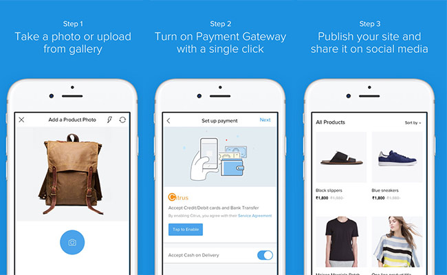

# App of the Week: Shopmatic Go

## A 2-minute solution to setting up your online store.

2017 年 2 月 4 日

來源：http://www.digit.in/apps/app-of-the-week-shopmatic-go-33594.html

撰文者：[Arnab Mukherjee](http://www.digit.in/author/arnab-mukherjee/)

When was the last time you bought something offline? Ok, that might be a stretch but it's undeniable that the things we shop for offline are reducing every day in number. During such times, setting up an online store for your products is absolutely necessary and Shopmatic Go aims to make that as easy as if can get.

If you're not really keen on interacting with web designers and developers, or have had a bad experience in the past, Shopmatic Go aims to fill that gap by providing an easy way to set up your online store right from your smartphone.

Available on [Android](https://play.google.com/store/apps/details?id=com.goshopmatic.ShopmaticGo) and [iOS](https://itunes.apple.com/in/app/shopmatic-go/id1174712646?mt=8), the App offers two plans - Go and Pro. While the Go is what you need to set up a pretty basic online store, some of the Pro features like a custom domain, international payment support, analytics etc are necessary if you want to set your store apart. Unfortunately, the app only offers the Go version, although it is clearly enough if you’re looking for a basic online store to get started without investing much on infrastructure.

The app is free and it will allow all individuals and merchants to develop their online stores by snapping pictures of their products, enabling payments, and selling their products by sharing on social channels, from their phones.

How easy is it? Well, to start off, you can login with your phone’s Google account or Facebook account (there’s a separate sign in as well, in case you don’t want to link this to your accounts). After a simple sign-in, you are prompted to add your first product. How complicated could that be? As easy as taking a picture. You click a picture of your product from your smartphone camera or select one from your album if you’ve got one ready. This is a handy feature since you might have done a professional photoshoot for whatever product you will be selling on your store.

Once the image selection is done, the next screen lets you edit your picture with certain Instagram-like filters. You can even pull off some specific edits from the advanced edits section, like adjusting the saturation, white balance and more. Once you’re satisfied with the image, hit next. The screen where you will be right now will prompt you to enter details about the product like the name, selling price, MRP, stock etc. The app doesn’t support batch uploads yet, so any database files or worksheets that you might have been maintaining your product data in might not be too useful here.

As the next step, you will have to setup your store. This will require you to select a name for your store, which will be appended by ‘.myshopmatic.com’ as a URL in the GO version of the service. Ensure that you’ve entered other details like Address, Contact number etc then move on to enabling the payment gateway (currently only Citrus Pay in India) in one tap and your store is ready to be published! Make sure that you’ve got everything right at this stage about your store since the store URL and certain other details are unchangeable after the store is live.

You can continue adding more products before or after the store is live and you can also share the store directly to social media from within the app. This truly makes setting up, managing and publicising your online store the matter of a few taps. If you’re a budding entrepreneur and have something to sell online, it couldn’t get easier than this.
